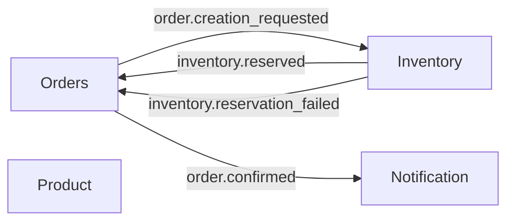

# dl-orders

A personal study project: an order flow built with multiple microservices. You create an order, inventory reserves (or fails), the order gets confirmed or cancelled, and notifications go out. Everything runs in a NestJS monorepo so you can see hexagonal architecture and event-driven messaging in one place.

## About

I built this to practice **hexagonal architecture** (ports & adapters) inside each service and **event-driven design** between them—without the usual enterprise boilerplate. It’s a small, runnable system you can use to see how events connect orders, inventory, and notifications end-to-end.

## Tech highlights

- **NestJS monorepo** — one repo, four apps: orders, inventory, product, notification
- **RabbitMQ** — event-driven communication (order created, inventory reserved/failed, order confirmed)
- **Hexagonal architecture** per app — domain (entities, ports), application (use cases), infrastructure (HTTP, messaging, persistence)
- **Database per service** — each app has its own Postgres (Prisma); orders, inventory, and notification use DynamoDB (LocalStack) for audit logs
- **Shared event contracts** — `@app/shared` lib with pattern names, queues, and event payloads
- **Zod** — request validation via a shared validation pipe

## Demo

No live demo; run everything locally (see [Quick start](#quick-start)).

## Architecture at a glance

Each microservice is structured with **hexagonal architecture**: the core is the domain and use cases; adapters (HTTP controllers, message consumers, repositories, publishers) sit in infrastructure and depend on ports defined in the domain.

Services talk to each other via **events** over RabbitMQ:



- **Orders** — Creates orders (HTTP), publishes `order.creation_requested`. Listens for `inventory.reserved` (confirm) and `inventory.reservation_failed` (cancel), then publishes `order.confirmed` so notification can send email.
- **Inventory** — Listens for `order.creation_requested`, reserves stock, publishes `inventory.reserved` or `inventory.reservation_failed`.
- **Product** — HTTP-only catalog (e.g. create product); no messaging.
- **Notification** — Listens for `order.confirmed` and sends email (e.g. via Resend).

## Practices used

- **Hexagonal (ports & adapters)**  
  - **Domain:** entities and ports (repository, event publisher, audit log, etc.).  
  - **Application:** use cases and DTOs; no infra here.  
  - **Infrastructure:** inbound (HTTP controllers, RabbitMQ consumers) and outbound (persistence, messaging, email). Persistence adapters live under `infrastructure/outbound/persistence/`, split into **sql/** (Prisma/Postgres) and **dynamodb/** (DynamoDB) so it’s clear which store each repo uses.  
  Wiring happens in the app module: ports bound to concrete implementations.

- **Event-driven**  
  RabbitMQ with shared pattern names and event payloads in `backend/libs/shared` (`patterns.ts`, `queues.ts`, and event types under `orders/events`, `inventory/events`). Each app that needs messaging connects as a microservice and subscribes to the right patterns.

- **Database per service**  
  Separate Postgres DB per app (Prisma). Orders, inventory, and notification also write audit entries to DynamoDB (LocalStack in dev); tables are created via `docker/localstack/init-aws.sh` or `backend/scripts/init-dynamodb-tables.js`.

- **Shared library**  
  `@app/shared` exposes queue names, pattern names, event DTOs, and a Zod validation pipe so all apps stay aligned on contracts.

## Repo structure

- **Root** — npm workspace; only `backend` is a workspace member. Scripts: Docker, dev, build, test, lint.
- **backend/** — NestJS monorepo:
  - **apps/** — `orders`, `inventory`, `product`, `notification` (each with its own `main.ts`, Prisma schema, optional Dockerfile).
  - **libs/shared** — constants, event types, validation.
  - **scripts/** — e.g. DynamoDB table init for local/CI.

## Prerequisites

- Node.js (LTS)
- Docker and Docker Compose (for RabbitMQ, Postgres, LocalStack)

## Quick start

1. **Install and start infra**

   ```bash
   npm install
   npm run docker:up
   ```

   This brings up RabbitMQ (5672, 15672), LocalStack (4566), and one Postgres per app.

2. **DynamoDB tables (audit)**  
   If LocalStack init didn’t create them, from the repo root:

   ```bash
   cd backend && npm run dynamodb:init
   ```

3. **Prisma**  
   Generate clients and push (or migrate) per app, e.g.:

   ```bash
   npm run prisma:orders:generate -w backend
   npm run prisma:orders:push -w backend
   ```

   Repeat for `inventory`, `product`, `notification` (see `backend/package.json` scripts).

4. **Env**  
   Each app can use an `.env` in `backend/apps/<app>/` (e.g. `DATABASE_URL`, `RABBITMQ_URL`, `QUEUE_NAME`, `PORT`). Copy from `.env.example` if present.

5. **Run the apps**  
   From repo root, run one or all:

   ```bash
   npm run dev:backend
   ```

   Or from `backend/` run a single app:

   ```bash
   npm run start:dev:orders
   npm run start:dev:inventory
   npm run start:dev:product
   npm run start:dev:notification
   ```

   Orders (3001), inventory (3002), product (3003), notification (3004 when HTTP is enabled in compose).

## Scripts reference

**From repo root**

| Script           | Description                |
|------------------|----------------------------|
| `docker:up`      | Start Docker stack         |
| `docker:down`    | Stop Docker stack          |
| `docker:logs`    | Follow Docker logs         |
| `dev:backend`    | Run backend in dev mode    |
| `build:backend`  | Build backend              |
| `test:backend`   | Run tests                  |
| `lint:backend`   | Lint and fix               |

**From `backend/`** — See `package.json` for the full list: per-app `build:<app>`, `start:dev:<app>`, Prisma generate/push/migrate per app, and `dynamodb:init`.

---

For more detail per service, see the READMEs in `backend/apps/orders`, `backend/apps/inventory`, `backend/apps/product`, and `backend/apps/notification`.
