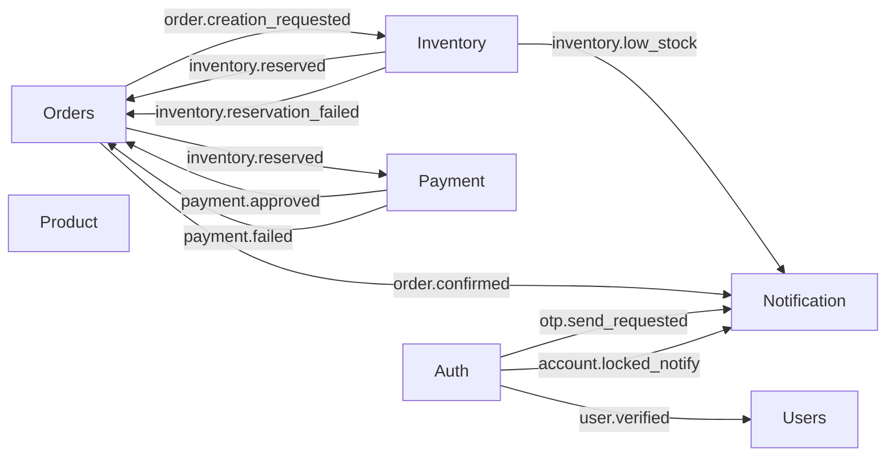

# dl-orders

A personal study project: an order flow built with multiple microservices. You create an order, inventory reserves (or fails), the order gets confirmed or cancelled, and notifications go out. Everything runs in a NestJS monorepo so you can see hexagonal architecture and event-driven messaging in one place.

## About

I built this to practice **hexagonal architecture** (ports & adapters) inside each service and **event-driven design** between them—without the usual enterprise boilerplate. It’s a small, runnable system you can use to see how events connect orders, inventory, and notifications end-to-end.

## Tech highlights

- **NestJS monorepo** — one repo, seven apps: orders, inventory, product, notification, auth, users, payment
- **RabbitMQ** — event-driven communication (order created, inventory reserved/failed, payment approved/failed, order confirmed, OTP send requested, user verified, account locked notify)
- **Hexagonal architecture** per app — domain (entities, ports), application (use cases), infrastructure (HTTP, messaging, persistence)
- **Database per service** — each app has its own Postgres (Prisma) except Product, which uses MongoDB. Orders, inventory, notification, and payment use MongoDB for audit logs and read models
- **Shared event contracts** — `@app/shared` lib with pattern names, queues, and event payloads
- **Zod** — request validation via a shared validation pipe
- **API documentation** — each service exposes interactive OpenAPI docs at `/docs` (Scalar UI)
- **Standardized error responses** — all HTTP errors return a consistent JSON body: `statusCode`, `error`, `message`, optional `details`, and `timestamp`
- **Redis** — shared instance (port 6379) for cache and lockout; Auth (lockout), Inventory (list cache), Product (by-id cache); keys namespaced by service prefix (`auth:`, `inventory:`, `product:`)

## Demo

No live demo; run everything locally (see [Quick start](#quick-start)).

## Architecture at a glance

Each microservice is structured with **hexagonal architecture**: the core is the domain and use cases; adapters (HTTP controllers, message consumers, repositories, publishers) sit in infrastructure and depend on ports defined in the domain.

Services talk to each other via **events** over RabbitMQ:


```mermaid
flowchart LR
    Orders -->|"order.creation_requested"| Inventory
    Inventory -->|"inventory.reserved"| Orders
    Inventory -->|"inventory.reservation_failed"| Orders
    Inventory -->|"inventory.low_stock"| Notification
    Orders -->|"inventory.reserved"| Payment
    Payment -->|"payment.approved"| Orders
    Payment -->|"payment.failed"| Orders
    Orders -->|"order.confirmed"| Notification
    Auth -->|"otp.send_requested"| Notification
    Auth -->|"account.locked_notify"| Notification
    Auth -->|"user.verified"| Users
    Product[Product]
```

- **Orders** — Creates orders (HTTP), publishes `order.creation_requested`. Listens for `inventory.reserved` (forwards to Payment), `inventory.reservation_failed` (cancel), `payment.approved` (confirm and publish `order.confirmed`), and `payment.failed` (cancel). Notification sends email when order is confirmed.
- **Inventory** — Listens for `order.creation_requested`, reserves stock, publishes `inventory.reserved` or `inventory.reservation_failed`. Also runs a low-stock check every 5 minutes and publishes `inventory.low_stock` to trigger alert emails. Caches list of inventory items (Redis, key prefix `inventory:`).
- **Payment** — Listens for `inventory.reserved` (from Orders). Creates Mercado Pago preference, stores checkout URL. Webhook receives approval/rejection; publishes `payment.approved` or `payment.failed` so Orders can confirm or cancel.
- **Product** — HTTP-only catalog (e.g. create product); no messaging. Caches product by ID (Redis, key prefix `product:`).
- **Notification** — Listens for `order.confirmed` (order confirmation email), `otp.send_requested` (OTP verification email), `account.locked_notify` (account locked after failed logins email), and `inventory.low_stock` (low-stock alert email); uses Resend.
- **Auth** — Signup (publishes `otp.send_requested` so notification sends OTP email), verify OTP, signin; issues JWT. After 3 failed signin attempts the account is locked for 5 minutes and Auth publishes `account.locked_notify` (notification sends the lockout email). Publishes `user.verified` when email is confirmed.
- **Users** — Listens for `user.verified`, stores user profile. HTTP `GET/PATCH /users/me` protected by JWT.

## Practices used

- **Hexagonal (ports & adapters)**  
  - **Domain:** entities and ports (repository, event publisher, audit log, etc.).  
  - **Application:** use cases and DTOs; no infra here.  
  - **Infrastructure:** inbound (HTTP controllers, RabbitMQ consumers) and outbound (persistence, messaging, email). Persistence adapters live under `infrastructure/outbound/persistence/`, split into **sql/** (Prisma/Postgres), **mongodb/** (MongoDB audit logs and Product catalog) so it’s clear which store each repo uses.  
  Wiring happens in the app module: ports bound to concrete implementations.

- **Event-driven**  
  RabbitMQ with shared pattern names and event payloads in `backend/libs/shared` (`patterns.ts`, `queues.ts`, and event types under `orders/events`, `inventory/events`). Each app that needs messaging connects as a microservice and subscribes to the right patterns.

- **Database per service**  
  Separate Postgres DB per app (Prisma) for orders, inventory, notification, auth, users, payment. Product uses MongoDB for the catalog. Orders, inventory, notification, and payment write audit entries (and read models where applicable) to separate MongoDB instances; connection via `MONGODB_URI` per app.

- **Shared library**  
  `@app/shared` exposes queue names, pattern names, event DTOs, and a Zod validation pipe so all apps stay aligned on contracts.

- **Idempotency**  
  **Orders:** Create-order accepts an `idempotencyKey` (UUID). If the same key is sent again, the API returns the existing order instead of creating a duplicate. **Payment:** When handling `inventory.reserved`, Payment uses the order’s idempotency key (or orderId as fallback) so that duplicate events (e.g. retries or at-least-once delivery) do not create duplicate payment records or duplicate Mercado Pago preferences.

## Repo structure

- **Root** — npm workspace; only `backend` is a workspace member. Scripts: Docker, dev, build, test, lint.
- **backend/** — NestJS monorepo:
  - **apps/** — `orders`, `inventory`, `product`, `notification`, `auth`, `users`, `payment` (each with its own `main.ts`; most have Prisma schema for Postgres; Product uses MongoDB only; optional Dockerfile).
  - **libs/shared** — constants, event types, validation, MongoDB module.

## Prerequisites

- Node.js (LTS)
- Docker and Docker Compose (for RabbitMQ, Redis, Postgres, MongoDB)

## Quick start

1. **Install and start infra**

   ```bash
   npm install
   npm run docker:up
   ```

   This brings up RabbitMQ (5672, 15672), Redis (6379), five MongoDB instances (27017–27021), and one Postgres per app (except Product, which uses MongoDB only).

2. **Prisma**  
   Generate clients and push (or migrate) per app (orders, inventory, notification, auth, users, payment). Product does not use Prisma. Example:

   ```bash
   npm run prisma:orders:generate -w backend
   npm run prisma:orders:push -w backend
   ```

   Repeat for `inventory`, `notification`, `auth`, `users`, `payment` (see `backend/package.json` scripts). Product uses MongoDB only; set `MONGODB_URI` in its `.env`.

3. **Env**  
   Each app can use an `.env` in `backend/apps/<app>/` (e.g. `DATABASE_URL`, `MONGODB_URI` where applicable, `RABBITMQ_URL`, `QUEUE_NAME`, `PORT`). Copy from `.env.example` if present.

4. **Run the apps**  
   From repo root, run one or all:

   ```bash
   npm run dev:backend
   ```

   Or from `backend/` run a single app:

   ```bash
   npm run start:dev:orders
   npm run start:dev:inventory
   npm run start:dev:product
   npm run start:dev:notification
   npm run start:dev:auth
   npm run start:dev:users
   npm run start:dev:payment
   ```

   Orders (3001), inventory (3002), product (3003), notification (3004), auth (3005), users (3006), payment (3007).

## API documentation

Each microservice serves interactive API docs (Scalar) at **`/docs`**:

| Service      | Port | Docs URL                   |
|--------------|------|----------------------------|
| Orders       | 3001 | http://localhost:3001/docs |
| Inventory    | 3002 | http://localhost:3002/docs |
| Product      | 3003 | http://localhost:3003/docs |
| Notification | 3004 | http://localhost:3004/docs |
| Auth         | 3005 | http://localhost:3005/docs |
| Users        | 3006 | http://localhost:3006/docs |
| Payment      | 3007 | http://localhost:3007/docs |

Start the app you need, then open the URL above in a browser to explore routes, request/response schemas, and try requests. The Users API uses Bearer (JWT) auth; get a token from Auth (`/auth/signin` or `/auth/verify-otp`) and use it in the Scalar UI.

## Scripts reference

**From repo root**

| Script           | Description                |
|------------------|----------------------------|
| `docker:up`      | Start Docker stack         |
| `docker:down`    | Stop Docker stack          |
| `docker:logs`    | Follow Docker logs         |
| `dev:backend`    | Run backend in dev mode    |
| `build:backend`  | Build backend              |
| `test:backend`   | Run tests                  |
| `lint:backend`   | Lint and fix               |

**From `backend/`** — See `package.json` for the full list: per-app `build:<app>`, `start:dev:<app>`, Prisma generate/push/migrate per app (except Product).

---

For more detail per service, see the READMEs in `backend/apps/orders`, `backend/apps/inventory`, `backend/apps/product`, `backend/apps/notification`, `backend/apps/auth`, `backend/apps/users`, and `backend/apps/payment`.
